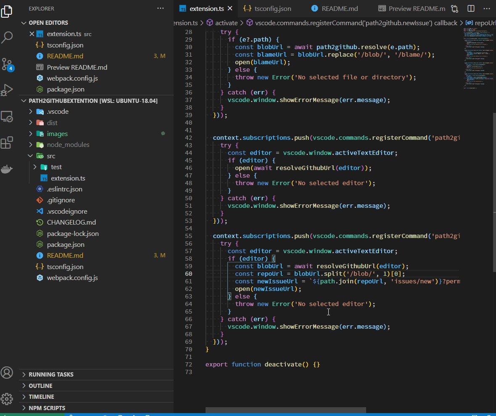
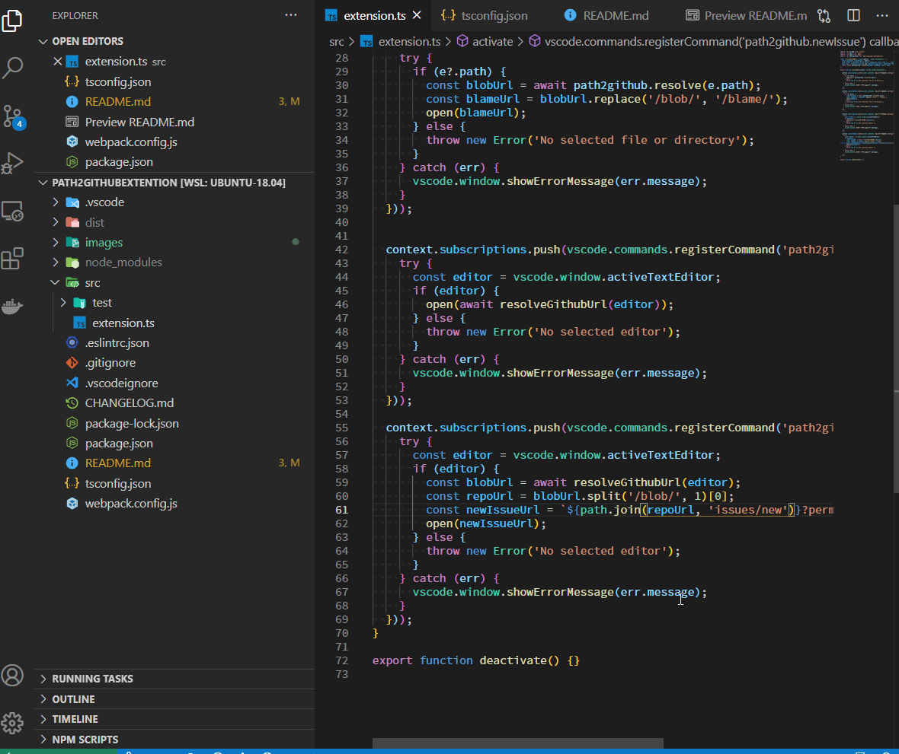

# path2github README

## Features

Open the selected file on Github.

### Open on Github

1. Select a file in Explorer or select text in the editor.
1. Select `Open on Github` from the menu.

### Blame on Github

1. Select a file in Explorer.
1. Select `Blame on Github` from the menu.

### Create new issue with a reference link

1. Select text in the editor.
1. Select `New Github issue` from the menu.

### Open workflow on Github

1. Select a file in Explorer or select text in the editor.
1. Select `Open Workflows on Github` from the menu.

## Requirements

- The file must be committed to git.
- The commit must be pushed to github.If not pushed, you will see a 404.
